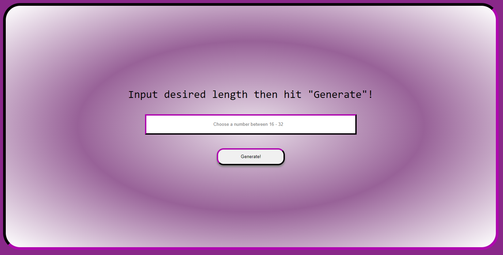

# Random Password Generator

This project is designed to generate a random password between 16 and 32 characters long. The user can input a desired length of the password and then press 'generate' to give a password containing both upper and lower case alphanumeric and special characters. The password is validated with RegEx and checked for at least 2 of: lower, upper case letters, integers and special characters. The characters are generated using their ASCII values (33 - 122) with the exception of 90 - 96.

## Usage

Deployed at:

https://jaycossey.github.io/password-generator/

## Front End

- HTML 
- CSS
- JS

## Contributions

For bug fixes please raise an issue on this repo
For improvements please create a pull request

## Support 

For support, please contact the dev team via:

https://github.com/Jaycossey

## License

See License